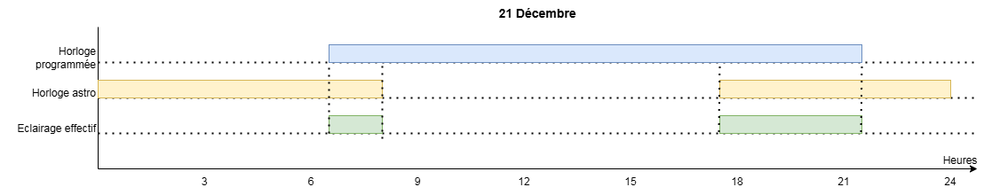

# Eclairage public "intelligent"

La gestion de l'éclairage public doit être simple : paramétrage et oubli. Il doit être autonome en toutes conditions. 

Un automate Crouzet [Millenium Slim](https://soda.crouzet.com/pn/?i=88983903) est utilisé ici pour être en charge de cette gestion sans nécessité de reprogrammation périodique.

L'automate fonctionnera sur le principe de deux horloges. La première est la définition des heures possibles d'allumage. Par exemple tous les matins de 6h00 à 8h30 et le soir de 17h00 à 21h30. La seconde horloge est astronomique et autorise l'allumage 4h jusqu'au lever du soleil et 7h après le coucher du soleil par exemple.

L'éclairage est effectivement allumé lorsque ces deux horloges sont d'accord. Cela permet de gérer les cas particuliers. Par exemple le lever du soleil qui a lieu avant la commande d'allumage du matin ou l'allumage qui voudrait démarrer avant le coucher du soleil. Cela donne une gestion sans maintenance.

## Fonctionnalités
- Calcule les heures de lever et coucher du soleil en fonction d'un point géographique
- Possède un calendrier d'allumage possible
- Gère les changements d'heure été/hiver
- Allume minimum 10 minutes
- Permet un allumage manuel pour une durée déterminée (mode télérupteur), via l'écran ou un bouton déporté
- Débrayer le fonctionnement des horloges (via l'écran ou un bouton déporté)
- Visualiser l'état de l'automate sur un écran
- Paramétrer la position géographique et du fuseau horaire via l'écran

## Exemples de fonctionnement

A valence, Drôme, France (longitude: -4.90 - Est Latitude: 44.89 - Nord fuseau horaire: +60)

## Mise en place

Le cablage est limité et s'adapte aux tableaux électriques existants. Si un modèle 24VDC est choisi, prévoir le bloc d'alimentation et les relais 24VDC nécessaires pour piloter les circuits d'éclairages nécessaires.

Les modèles à relai mécaniques sont suffisants pour piloter des contacteurs ou alimenter le circuit directement. Attention à la charge maximale en pointe lors de l'allumage. Un modèle à relai statique ne peut piloter que des contacteurs.

### Pré-requis

- Un automate [Millenium SLIM CB8R](https://www.crouzet.com/products/automation-controllers/millenium-slim)
- Alimentation 24V si vous avez la version 24V de l'automate
- Le logiciel [Crouzet Soft](https://www.crouzet.com/softwares/download) gratuit _(Windows seulement)_
- Le [dongle USB Bluetooth](https://soda.crouzet.com/pn/?i=88980124) si Windows 11
- Le programme `Slim_EclairagePublic.pcs`
- L'application [Crouzet Virtual Display](https://www.crouzet.com/produits/controleurs-automatisme/software/crouzet-virtual-display/) (écran déporté sur PC ou smartphone) - gratuit

### Schéma de câblage

Ce schéma ne montre pas les protections électrique et/ou l'alimentation

### Chargement du programme

- Installez le logiciel CrouzetSoft et laissez les drivers s'installer en même temps
- Brancher le dongle et vérifier qu'il s'affiche dans le gestionnaire de périphérique comme port série
- Alimentez votre automate
- Depuis CrouzetSoft essayez de vous connecteur à l'automate (Contrôleur > Configurer la connexion > Bouetooth)
- Si le test est OK, passez à la suite, sinon, désactiver le bluetooth de votre ordinateur, redémarrez et recommencez
- Ouvrir fichier du programme  `Slim_EclairagePublic.pcs`
- Modifiez les paramètres  nécessaires
- Lancez la simulation si nécessaire
- Chargez le programme dans l'automate

### Personnalisation du programme

- durée de la commande manuelle - bloc B88 - en haut
- plages horaires autorisées - bloc  B95 - au milieu gauche
- paramètres de l'horloge astronomique - bloc B00 - au milieu gauche
- durée de l'éclairage minimum - bloc B21 - au milieu droite

Notez que le positionnement géographique est accessible via l'écran (boutons haut / bas pour défiler, OK pour entrer en mode édition, haut/bas pour modifier, OK pour valider). La position géographique est nécessaire pour le calcul correct des heures de lever et coucher du soleil.

## Maintenance

A part si les plages horaires autorisée de l'éclairage change, une seule est nécessaire : recaler l'horloge une fois par an avec l'application Crouzet Virtual Display

## Autres usages

Si cela a été pensé pour un éclairage public, cela peut servir de base pour bien d'autres usage. Quelques exemples:
- Eclairage du jardin pour des particuliers
- Gestion des volets roulants motorisés avec quelques modifications
- Gestion de la porte d'un poulailler
- etc...
