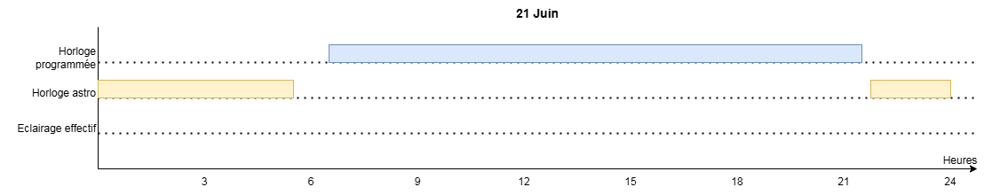

# Eclairage public "intelligent"

Pensé à l'origine pour un éclairage public (ou de jardin, de vitrine ou d'enseigne lumineuse), ce programme est adapté pour toutes les gestions d'équipement en fonction d'un horaire, du levé et couché du soleil. Il peut donc s'adapter à différents usages moyennant quelques petites modifications
- Signalétique aux abords des écoles
- Eclairage de jardin ou piscine
- Etc...

## Raison d'être de ce programme

Il part de deux constats:
- Les horloges astronomiques classiques, basées sur des évènements horaires non hiérarchisés, amènent à des incohérences de pilotage. Par exemple, la commande d'extinction au lever du jour peut avoir lieu avant la commande d'allumage à 6h00. L'éclairage reste donc allumé en journée. Il est alors nécessaire d'intervenir sur l'horloge.
- Il est nécessaire de diminuer la consommation d'énergie en évitant un fonctionnement toute la nuit. Cela préserve aussi la biodiversité nocturne et aide au développement [des réserves de ciel étoilé](https://fr.wikipedia.org/wiki/R%C3%A9serve_de_ciel_%C3%A9toil%C3%A9).

## Fonctionnalités
Les fonctionnalités proposées incluent
- Calcul les heures de lever et coucher du soleil en fonction d'un point géographique
- Deux horaires d'allumage et d'extinction paramétrables (semaine et week-end)
- Gestion automatique des changements d'heure été/hiver
- Temps minimum d'allumage paramétrable
- Allumage manuel pour une durée prédéterminée (mode télérupteur - 9h max)
- Débrayage du fonctionnement des horloges
- Visualiser l'état de l'automate sur un écran (via un téléphone)
- Gestion des sorties - choisir les sorties activables
- Paramétrage de toutes les fonctionnalités via un écran dédié à chacune

Un automate Crouzet [Millenium Slim](https://soda.crouzet.com/pn/?i=88983903) est utilisé. Il représente un investissement assez faible. Le programme s'adapte aisément sur d'autres automates de la même marque.

## Exemples de fonctionnement

Le programme propose 2 calendriers. Le premier gère les plages horaires, le second gère l'horloge astronomique. L'allumage est effectif uniquement si les deux calendriers sont actifs simultanément (ET logique). Cela diminue la maintenance nécessaire puisque la programmation s'adapte parfaitement tout au long de l'année

A valence, Drôme, France (longitude: -4.90 - Est Latitude: 44.89 - Nord fuseau horaire: +60)

## Ecran

L'application Crouzet Virtual Display permet d'afficher l'état de l'automate avec la date, l'heure et les horaires de lever et coucher du soleil.  
Chaque paramètre est accessible via cet écran également.  

Les boutons ont les fonctions suivantes :
- A : allumage / extinction manuel de l'éclairage
- B : activer / désactiver le fonctionnement automatique selon les horloges
- Haut / Bas: accès aux écrans de configuration
- Ok : entrer en mode édition / valider l'édition
- Esc: retour à l'écran principal

## Documentation

Une version imprimable de la [documentation](./res/eclairage_public_documentation.pdf) est disponible.

## Mise en place

Le câblage est limité et s'adapte aux tableaux électriques existants. Si un modèle 24VDC est choisi, prévoir le bloc d'alimentation. Vérifiez que les relais de l'automate supportent le courant d'appel de l'éclairage. En cas de doute, préférez un contacteur de puissance piloté par les relais de l'automate.

### Prérequis

- Un automate [Millenium SLIM CB8R](https://www.crouzet.com/products/automation-controllers/millenium-slim)
- Alimentation 24V si vous avez la version 24V de l'automate
- Le logiciel [Crouzet Soft](https://www.crouzet.com/softwares/download) gratuit _(Windows seulement)_
- Le [dongle USB Bluetooth LE - Serial](https://soda.crouzet.com/pn/?i=88980124) utile dans certains cas - ou tout dongle BLE avec le profil RFCOMM
- Le programme `Slim_EclairagePublic_xxxx.pcs` disponible ici
- L'application [Crouzet Virtual Display](https://www.crouzet.com/produits/controleurs-automatisme/software/crouzet-virtual-display/) (écran déporté sur PC ou smartphone) - gratuit

### Schéma de câblage

Ce schéma ne montre pas les protections électrique et/ou l'alimentation  

Les deux entrées (éclairage manuel et désactivation de la fonction horloge) nécessitent un interrupteur de type momentané (bouton poussoir). Cette partie est optionnelle.

### Chargement du programme

- Installez le logiciel CrouzetSoft et laissez les drivers s'installer en même temps
    - (option) Brancher le dongle et vérifier qu'il s'affiche dans le gestionnaire de périphérique comme port série
- Alimentez votre automate
- Depuis CrouzetSoft essayez de vous connecteur à l'automate (Contrôleur > Configurer la connexion > Bluetooth)
    - Si le test est OK, passez à la suite, sinon, désactiver le bluetooth de votre ordinateur, redémarrez et recommencez
- Ouvrir fichier du programme  `Slim_EclairagePublic_xxxx.pcs`
- Lancez la simulation si vous souhaitez le vérifier
- Mettez à jour le firmware de l'automate (contrôleur > mise à jour du logiciel et de la langue)
- Injectez le programme dans l'automate

### Personnalisation du programme

Cela se fait à travers les écrans de paramétrage. Il est impératif de les parcourir pour définir les paramètres initiaux de fonctionnement (Brest et Valence n'ont pas les mêmes heures de lever et coucher du soleil par exemple).

Pour ceux qui veulent étudier le programme, le [diagramme complet](./res/Slim_EclairagePublic_V2.1_techdoc.pdf) est disponible.

## Maintenance

Une seule est nécessaire : recaler l'horloge deux fois par an avec l'application Crouzet Virtual Display

## Autres automates

Les automates EM4, Milenium Evo et Millenium sont compatibles (même logiciel de programmation).
## Historique des versions

- V1.0 11/2024 - permet de gérer les deux calendriers paramétrables avant la programmation de l'automate
- V2.0 01/2025 - permet d'accéder à tous les paramètres depuis l'écran de l'automate (virtuel dans le cas du SLIM)
- V2.1 04/2025 - Ajout de la gestion des sorties, correction d'un bug avec l'horloge astronomique
- V2.1.1 12/2025 - Migration vers CrouzetSoft 1.14

